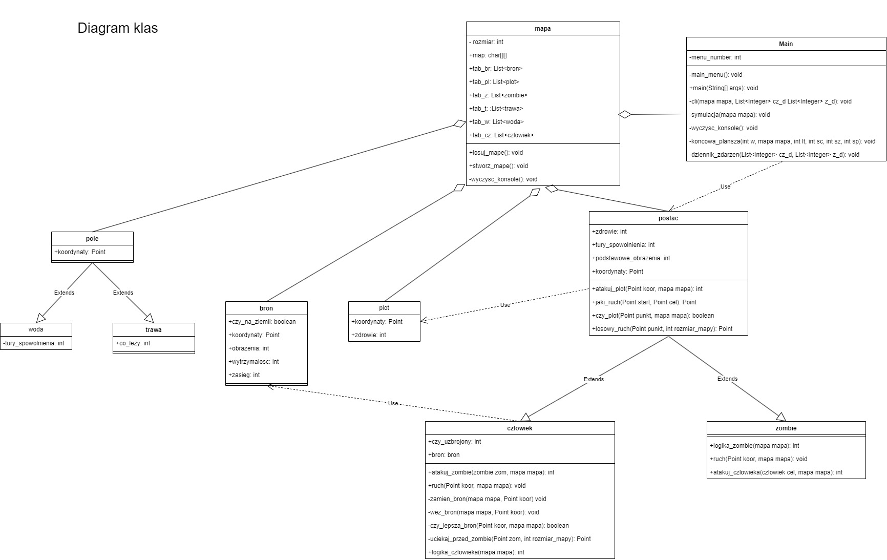
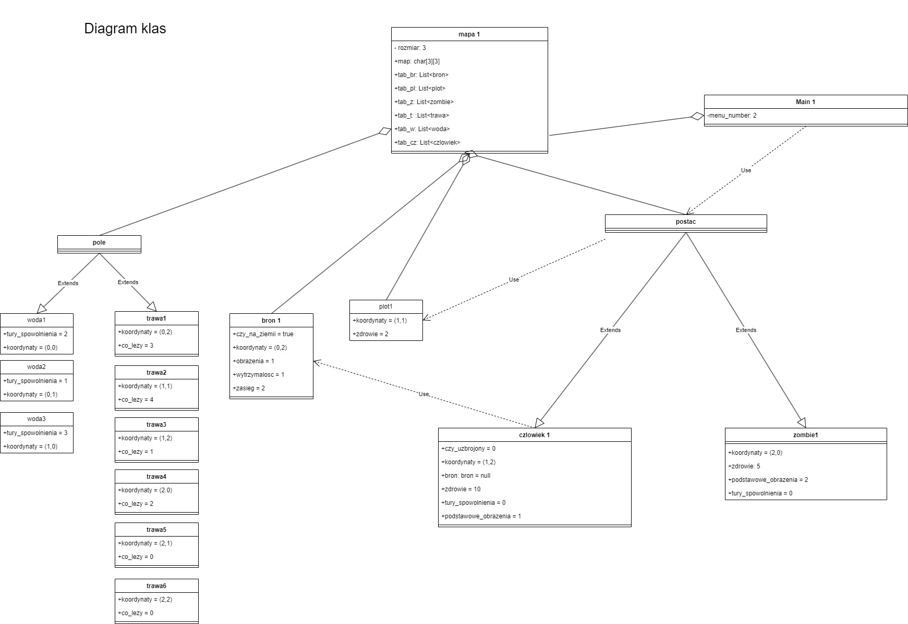

# Apokalipsa
## Co to jest?
Apokalipsa to program napisany w javie, który symuluje walkę o przetrwanie ludzi podczas apokalipsy zombie na mapie o podanym rozmiarze przez użytkownika. Na mapie można napotkać poza zombie i ludźmi płoty, które blokują drogę, lecz można je zniszczyć; bronie, które leżą na ziemii, ludzie mogą je podnieść i używać do obrony 
przed zombie; pole trawy, po którym chodzą ludzie i zombie oraz pole wody, które może ich również spowolnić. Symulacja kończy się w momencie kiedy umrą wszyscy ludzie lub wszystkie zombie.
## Wersja javy
Oracle OpenJDK version 22
## Jak uruchomić program
Należy "zbuildować" projekt, a następnie uruchomić metodę main w klasie Main.
## Diagram klas

## Diagram obiektów

## Klasy
### Main
**Atrybuty**

`static int menu_number` - statyczna zmienna typu int o nazwie menu_number, której celem jest trzymanie numeru, który wybrał użytkownik podczas korzystania z menu programu.

**Metody**

`public static void main(String[] args)` - publiczna statyczna metoda typu void o nazwie main, która rozpoczyna cały program symulacji inicjując nowy obiekt klasy Main, a następnie przechodząc do głównegu menu programu.

`private void main_menu()` - prywatna metoda typu void o nazwie main_menu, która wyświetla na ekranie menu główne programu i po wybraniu odpowiedniej opcji przez użytkownika przechodzi do kolejnych części symulacji.

`private void symulacja(mapa mapa)` - prywatna metoda typu void o nazwie symulacja, przyjmuje ona obiekt klasy mapa. Jest to główna metoda całego programu, w której odbywa się cała symulacja.

`private void cli(mapa mapa, List<Integer> cz_d, List<Integer> z_d)` - prywatna metoda tpyu void o nazwie cli, przyjmuje ona obiekt klasy mapa, listę liczb całkowitych cz_d oraz z_d. Jej celem jest wyświetlenia interfejsu konsolowego użytkownika podczas symulacji.

`private void wyczysc_konsole()` - prywatna metoda typu void o nazwie wyczysc_konsole, której celem jest wyczyszczenie konsoli przez wyświetlenie 100 pustych linijek.

`private void dziennik_zdarzen(List<Integer> cz_d, List<Integer> z_d)` - prywatna metoda typu void o nazwie dziennik_zdarzen, przyjmuje listę liczb całkowitych cz_d oraz z_d. Jej celem jest wyświetlenie dziennika zdarzeń, tak aby użytkownik miał lepsze pojęcie co się stało na mapie.

`private void koncowa_plansza(int w, mapa mapa, int lt, int sc, int sz, int sp)` - prywatna metoda typu void o nazwie koncowa_plansza, przyjmuje ona obiekt klasy mapa oraz 5 liczb całkowitych:

- int w: kto wygrał symulacje (1 - ludzie, 0 - zombie)
- int lt: ile tur trwała symulacja
- int sc: ile było ludzi na początku
- int sz: ile było zombie na początku
- int sp: ile było płotków na początku

Jej celem jest wyświetlenie podsumowania na koniec symulacji.
### postac
**Atrybuty**

`public int zdrowie` - publiczna zmienna typu int, która trzyma zdrowie postaci.

`public int podstawowe_obrażenia` - publiczna zmienna tpyu int, która trzyma podstawowe obrażenia postaci.

`public Point koordynaty` - publiczny obiekt klasy Point, który trzyma koordynaty postaci.

`public int tury_spowolnienia` - publiczna zmienna tpyu int, która trzyma liczbę tur, przez która postać jest spowolniona przez wodę.

**Metody**

`public int atakuj_plot(Point koor, mapa mapa)` - publiczna metoda typu int o nazwie atakuj_plot, która przyjmuje obiekt klasy Point koor oraz obiekt klasy mapa mapa. Jej celem jest wykonanie ruchu ataku w celu zniszczenia płotu, jeśli płot został zniszczony zwraca wartość 2, w przeciwnym wypadku zwraca 1.

`public Point losowy_ruch(Point koor, int rozmiar_mapy)` - publiczna metoda typu Point o nazwie losowy_ruch, która przyjmuje obiekt klasy Point koor oraz liczbę całkowitą int rozmiar_mapy. Jej celem jest wylosowanie ruchu, który wykona postać. Zwraca obiekt klasy Point - wylosowany punkt.

`public Point jaki_ruch(Point start, Point cel)` - publiczna metoda typu Point o nazwie jaki_ruch, która przyjmuje dwa obiekty klasy Point: start i cel. Jej celem jest wybranie najbardziej optymalnego ruchu, który należy wykonać aby dostać się z Point start do Point cel. Zwraca obiekt klasy Point - wybrany ruch.

`public boolean czy_plot(Point punkt, mapa mapa)` - publiczna metoda tpyu boolean czy_plot, która przyjmuje obiekt klasy Point punkt oraz obiekt klasy mapa mapa. Jej celem jest sprawdzenie czy pole, na które postać chce wykonać ruch jest zajęte przez obiekt klasy plot. Zwraca true jeśli jest zajęte, false jeśli nie jest.
### czlowiek
**Dziedziczy klase postac**

**Atrybuty~**

`int czy_uzbrojony` - zmienna typu int o nazwie czy_uzbrojony, która trzyma wartość 1 jeśli czlowiek jest uzbrojony, w przeciwnym wypadku 0.

`bron bron` - obiekt klasy bron o nazwie bron, bron trzymana przez czlowieka.

**Metody**

`public int logika_czlowieka(mapa mapa)` - publiczna metoda typu int o nazwie logika_czlowieka, która przyjmuje obiekt klasy mapa mapa. Jej celem jest podjęcie decyzji o następnym ruchu wykonanego przez człowieka. Zwraca:

- 1: człowiek zaatakował zombie
- 2: człowiek uciekał przed zombie
- 3: człowiek podszedł do broni leżącej na ziemii
- 4: człowiek wykonał losowy ruch
- 5: człowiek zabił zombie
- 6: człowiek zniszczył płot
- 7: człowiek porusza się w stronę zombie
- 8: człowiek zaatakował płot

`public int atakuj_zombie(zombie zom, mapa mapa)` - publiczna metoda typu int o nazwie atakuj_zombie, która przyjmuje obiekt klasy zombie zom oraz obiekt klasy mapa mapa. Jej celem jest wykonanie ruchu ataku na zombie. Zwraca 1 jeśli udało się zabić zombie, w przeciwnym wypadku 0.

`public void ruch(Point koor, mapa mapa)` - publiczna metoda typu void o nazwie ruch, która przyjmuje obiekt klasy Point koor oraz obiekt klasy mapa mapa. Jej celem jest wykonanie ruchu przez człowieka.

`public boolean czy_lepsza_bron(Point koor, mapa mapa)` - publiczna metoda typu boolean o nazwie czy_lepsza bron, która przyjmuje obiekt klasy Point koor oraz obiekt klasy mapa mapa. Jej celem jest sprawdzenie czy bron, którą człowiek może podnieść jest lepsza. Zwraca true jeśli jest lepsza, w przeciwnym wypadku false.

`private void zamien_bron(mapa mapa, Point koor)` - prywatna metoda tpyu void o nazwie zamien_bron, która przyjmuje obiekt klasy mapa mapa oraz obiekt klasy Point koor. Jej celem jest wymiana broni przez człowieka.

`private void wez_bron(mapa mapa, Point koor)` - prywatna metoda typu void o nazwie wez_bron, która przyjmuje obiekt klasy mapa mapa oraz oiekt klasy Point koor. Jej celem jest wzięcie broni przez człowieka z pola trawy.

`private Point uciekaj_przed_zombie(Point zom, int rozmiar_mapy)` - prywatna metoda tpyu Point o nazwie uciekaj_przed_zombie, która przyjmuje obiekt klasy Point zom oraz int rozmiar_mapy. Jej celem jest wybranie odpowiedniego pola, na który człowiek musi się udać w celu ucieknięcia przed zombie. Zwraca punkt, na który musi się udać człowiek.
### zombie
**Dziedziczy klase postac**

**Metody**

`public int logika_zombie(mapa mapa)` - publiczna metoda tpyu int o nazwie logika_zombie, która przyjmuje obiekt klasy mapa mapa. Jej celem jest wybranie i wykonanie odpowiedniego ruchu przez zombie. Zwraca odpowiednio:

- 1: zombie zatakował człowieka
- 2: zombie poszedł do człowieka
- 3: zombie poszedł w losowym kierunku
- 4: zombie zaatakował płot
- 5: zombie zabił człowieka
- 6: zombie zniszczył płot

`public void ruch(Point koor, mapa mapa)` - publiczna metoda typu void o nazwie ruch, która przyjmuje obiekt klasy Point koor oraz obiekt klasy mapa mapa. Jej celem jest wykonaniue ruchu na odpowiedni punkt.

`public int atakuj_czlowieka(czlowiek cel, mapa mapa)` - publiczna metoda typu int o nazwie atakuj_czlowieka, która przyjmuje obiekt klasy czlowiek cel oraz obiekt klasy mapa mapa. Jej celem jest wykonanie ataku na człowieku. Zwraca 2 jeśli udało się zabić człowieka, w przeciwnym wypadku 1.
### pole
**Atrybuty** 

`Point koordynaty` - obiekt klasy Point o nazwie koordynaty, który trzyma koordynaty pola.
### woda
**Dziedziczy klase pole**

**Atrybuty**

`int tury_spowolnienia` - zmienna typu int, która trzyma wartość tur spowolnienia, które nałożą się na postać po wejściu na to pole.
### trawa
**Dziedziczy klase pole**

**Atrybuty**

`int co_lezy` - zmienna typu int, która trzyma wartość co się znajduje na polu trawy. Odpowiednio:

- 0: nic
- 1: czlowiek
- 2: zombie
- 3: broń
- 4: płot
### plot
**Atrybuty**

`int zdrowie` - zmienna typu int, która trzyma wartość zdrowia tego płotu.

`Point koordynaty` - obiekt klasy Point, który trzyma koordynaty tego płotu.
### mapa
**Atrybuty**

`int rozmiar` - zmienna typu int, która trzyma rozmiar mapy.

`public char[][] map` - dwuwymiarowa tablica zmiennych typu char, jest przedstawieniem tego jak wygląda mapa, na której dzieje się symulacja. Legenda mapy:
' ' - trawa

w - woda

b - bron

z - zombie

c - czlowiek

p - plot

o - zombie w wodzie

l - czlowiek w wodzieF

m - zombie i bron

i - czlowiek i bron

e - pare zombie na jednym polu

k - pare ludzi na jednym polu

`public List<czlowiek> tab_cz` - obiekt klasy List, który trzyma wszystkie obiekty klasy czlowiek.

`public List<bron> tab_br` - obiekt klasy List, który trzyma wszystkie obiekt klasy bron.

`public List<plot> tab_pl` - obiekt klasy List, który trzyma wszystkie obiekt klasy plot.

`public List<zombie> tab_z` - obiekt klasy List, który trzyma wszystkie obiekt klasy zombie.

`public List<trawa> tab_t` - obiekt klasy List, który trzyma wszystkie obiekt klasy trawa.

`public List<woda> tab_w` - obiekt klasy List, który trzyma wszystkie obiekt klasy woda.

**Metody**

`public void losuj_mape()` - publiczna metoda typu void o nazwie losuj_mape. Jej celem jest wylosowanie mapy do symulacji.

`public void stworz_mape()` - publiczna metoda tpyu void o nazwie stworz_mape. Jej celem jest umożliwienie użytkownikowi stworzenie mapy, która następnie zostanie użyta do symulacji.
### bron
**Atrybuty**

`int obrazenia` - zmienna typu int, która trzyma obrażenia zadawane przez broń.

`int wytrzymalosc` - zmienna typu int, która trzyma wytrzymałość broni.

`int zasieg` - zmienna typu int, która trzyma zasięg broni.

`boolean czy_na_ziemii` - zmienna typu boolean, która mówi o tym czy broń jest na ziemii czy nie.

`Point koordynaty` - obiekt klasy Point, który trzyma kordynaty bronii.
